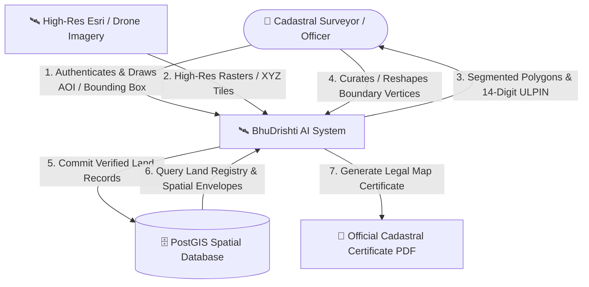
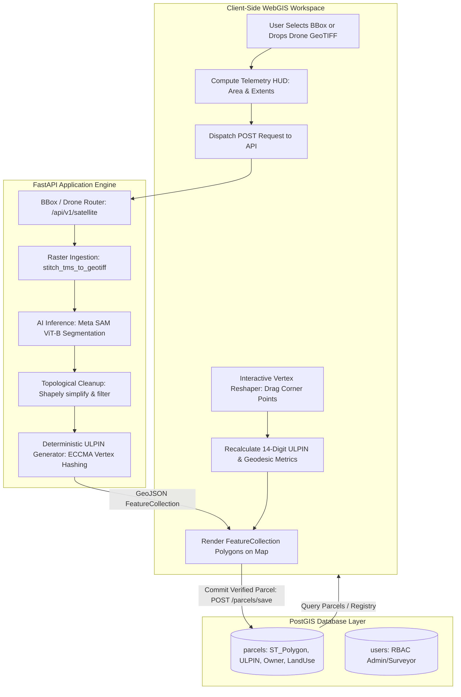
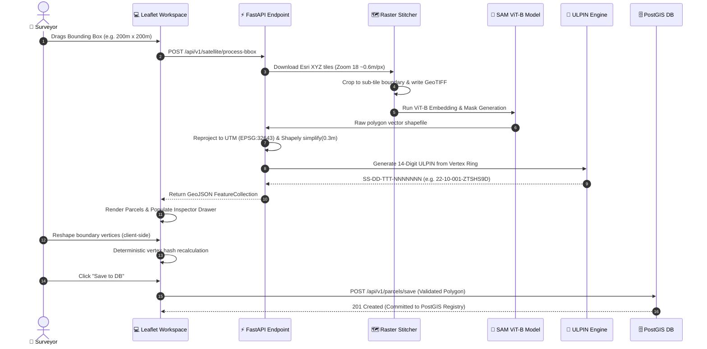
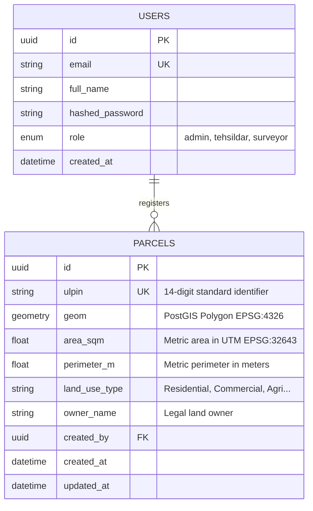

# 📘 Project Report: BhuDrishti AI
### *Autonomous Geospatial AI System for Automated Cadastral Vectorization, Client-Side Boundary Curation, and Standardized 14-Digit ULPIN (Bhu-Aadhaar) Generation*

---

## 1. Executive Summary & Problem Context

Cadastral land surveying in developing nations has historically relied on labor-intensive manual boundary tracing, total station measurements, and fragmented local revenue registers. These manual processes introduce:
1. **Prolonged Survey Cycles:** Months required to survey municipal sectors or agricultural blocks.
2. **Boundary Discrepancies & Encroachments:** Lack of sub-meter vector precision leading to litigations and land disputes.
3. **Identifier Inconsistencies:** Use of localized plot numbers rather than unified, deterministic spatial identifiers.

**BhuDrishti AI** resolves these challenges by uniting foundational Computer Vision (**Meta SAM ViT-B**), cloud geospatial STAC feeds, client-side browser WebGIS, and the official **14-digit Unique Land Parcel Identification Number (ULPIN / Bhu-Aadhaar)** standard defined by the Department of Land Resources (DoLR), Government of India and the Electronic Commerce Code Management Association (ECCMA).

---

## 2. Technology Stack & Architectural Overview

```
Frontend:
├── Vanilla ES6+ Modular Javascript (No bloated frameworks)
├── Leaflet.js 1.9.4 (Spatial rendering engine & Tile layers)
├── Tailwind CSS (Light Frosted Glassmorphic Design System)
├── geotiff.js & proj4.js (Client-side raster parsing & CRS transformation)
└── jsPDF (Cadastral Certificate generation)

Backend:
├── FastAPI 0.110+ (Asynchronous ASGI Web Framework)
├── SQLAlchemy 2.0 + GeoAlchemy2 (ORM & Spatial Engine)
├── PostgreSQL 15+ & PostGIS 3.3+ (Spatial Database)
├── RasterIO & Pillow (GDAL-independent Tile Stitcher)
├── Segment-Geospatial / SamGeo (Meta SAM ViT-B Engine)
└── Shapely & Pyproj (Metric UTM Reprojection & Topological Cleanup)
```

---

## 3. Data Flow Diagrams (DFD)

### 3.1 DFD Level 0: Context Diagram



---

### 3.2 DFD Level 1: Core Subsystem Data Flow



---

### 3.3 DFD Level 2: Detailed AI Boundary Extraction & ULPIN Pipeline



---

## 4. Official 14-Digit ULPIN (Bhu-Aadhaar) Specification

BhuDrishti implements the **Unique Land Parcel Identification Number (ULPIN)** standard defined by the Department of Land Resources (DoLR) and the Electronic Commerce Code Management Association (ECCMA):

### Structure:
- **Total Length:** 14 Alphanumeric Characters (Stored: `SSDDTTTNNNNNNN`, Display: `SS-DD-TTT-NNNNNNN`)
- **Characters 1–2 (SS):** State Code from Local Government Directory (e.g., `22` for Chhattisgarh).
- **Characters 3–4 (DD):** District Code (e.g., `10` for Raipur).
- **Characters 5–7 (TTT):** Sub-District / Tehsil Code (e.g., `001` for Raipur Urban).
- **Characters 8–14 (NNNNNNN):** 7-character deterministic Base36 alphanumeric string derived from canonical polygon vertex coordinates in WGS-84 coordinate reference system.

### Mathematical Properties:
$$\text{ULPIN} = \text{State} \parallel \text{District} \parallel \text{Tehsil} \parallel \text{Base36}\left(\operatorname{SHA256}(\text{CanonicalVertices})\right)[0..6]$$

- **Orientation Invariant:** Canonical vertex rotation ensures clockwise/counter-clockwise rings yield identical identifiers.
- **Partition Sensitivity:** Any boundary alteration (vertex movement, plot subdivision, amalgamation) automatically produces a new, unique legal ULPIN.

---

## 5. Database Schema & Spatial Entity Modeling



---

## 6. Performance & Scalability Enhancements

1. **Adaptive Zoom Capping:** Bounding box zoom is dynamically capped at Level 18 (~0.6m ground resolution), reducing tile download payloads by over 60% compared to Level 19 with negligible boundary variance.
2. **Concurrent Multi-Threaded Tile Fetching:** Python `ThreadPoolExecutor` downloads XYZ tiles concurrently across pooled HTTP connections.
3. **Windows File Lock Safety:** Explicit garbage collection and safe cleanup prevent file handle locks with rasterio and GDAL C-extensions.
4. **Client-Side Heavy Operations:** Geodesic area, perimeter calculations, GeoTIFF parsing, and live vertex reshaping run entirely in client JavaScript, reducing server compute loads.

---

## 7. Conclusion

BhuDrishti AI transforms land administration from manual, error-prone surveying into an automated, legally sound, sub-meter accurate geospatial workflow. By combining modern AI segmentation with official government standards, it provides an end-to-end foundation for Digital India land modernization initiatives.
