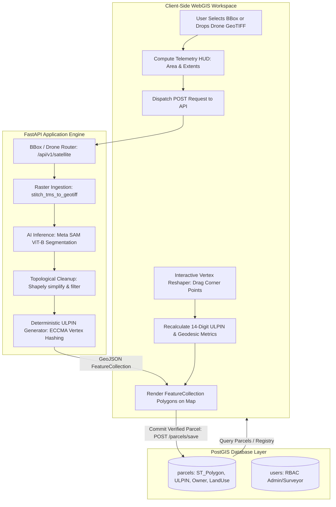
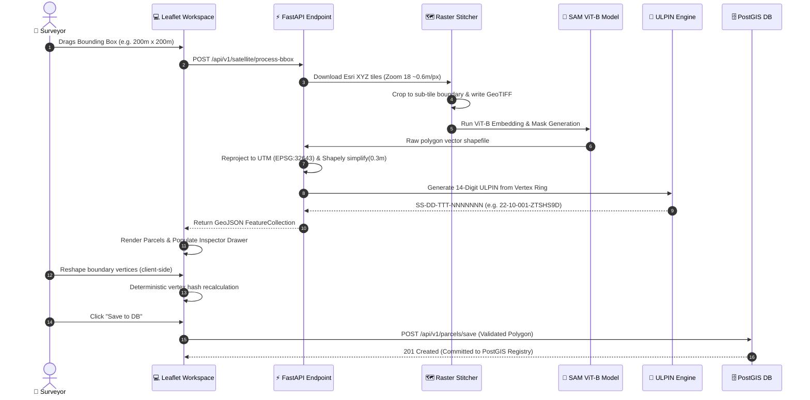
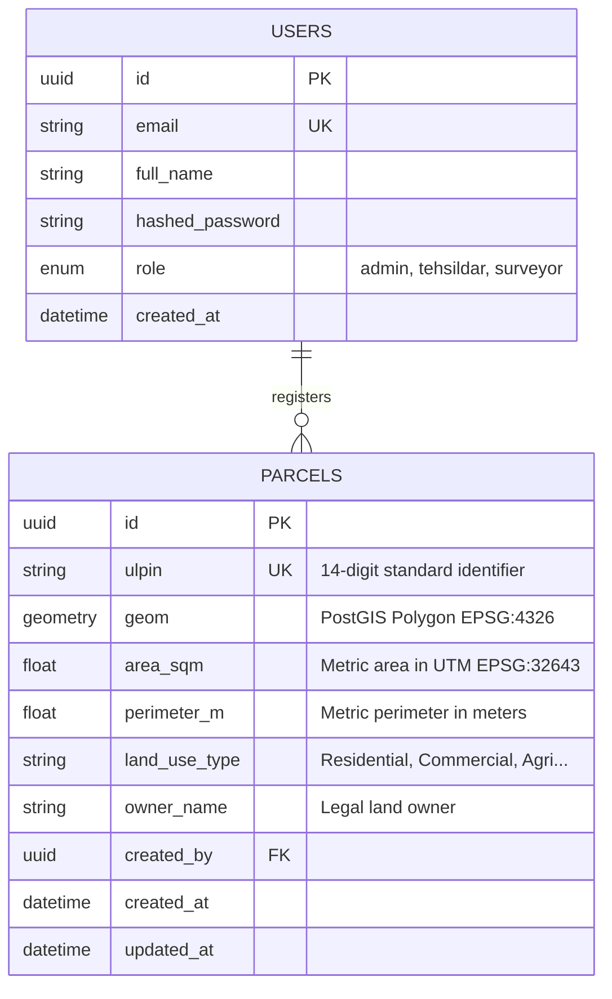
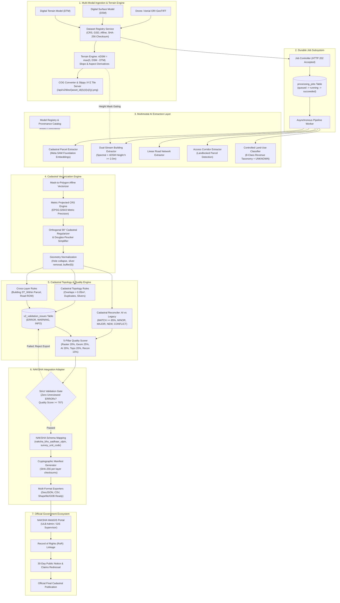
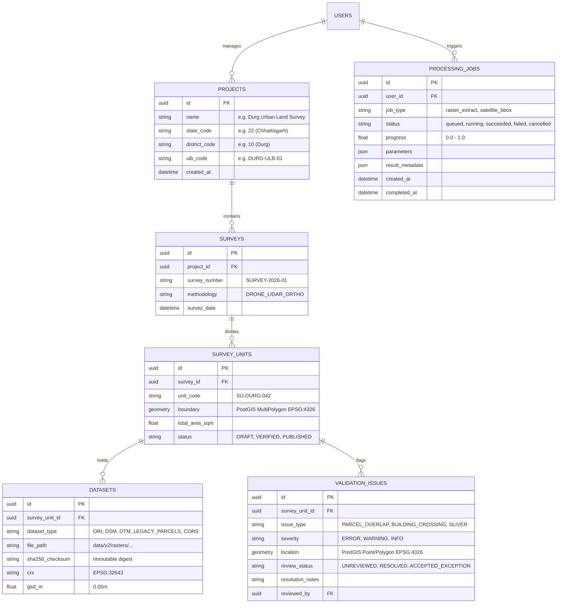

# 📘 Project Report: BhuDrishti AI
### *Autonomous Geospatial AI System for Automated Cadastral Vectorization, Client-Side Boundary Curation, Standardized 14-Digit ULPIN (Bhu-Aadhaar) Generation, and NAKSHA (DoLR / DILRMP) Enterprise Cadastral Processing*

---

## 1. Executive Summary & Problem Context

Cadastral land surveying in developing nations has historically relied on labor-intensive manual boundary tracing, total station measurements, and fragmented local revenue registers. These manual processes introduce:
1. **Prolonged Survey Cycles:** Months required to survey municipal sectors or agricultural blocks.
2. **Boundary Discrepancies & Encroachments:** Lack of sub-meter vector precision leading to litigations and land disputes.
3. **Identifier Inconsistencies:** Use of localized plot numbers rather than unified, deterministic spatial identifiers.

**BhuDrishti AI** resolves these challenges by uniting foundational Computer Vision (**Meta SAM ViT-B**), cloud geospatial STAC feeds, client-side browser WebGIS, and the official **14-digit Unique Land Parcel Identification Number (ULPIN / Bhu-Aadhaar)** standard defined by the Department of Land Resources (DoLR), Government of India and the Electronic Commerce Code Management Association (ECCMA).

With the introduction of **BhuDrishti V2**, the platform expands from a single-AOI parcel segmentation prototype into an **enterprise-grade Cadastral Processing & Decision-Support Layer** architected for the Government of India's **NAKSHA** (National Geospatial Knowledge-based Land Survey of Habitations in Urban Areas) ecosystem.

---

## 2. Technology Stack & Architectural Overview

```
Frontend:
├── Vanilla ES6+ Modular Javascript (No bloated frameworks)
├── Leaflet.js 1.9.4 (Spatial rendering engine & Tile layers)
├── Tailwind CSS (Light Frosted Glassmorphic Design System)
├── geotiff.js & proj4.js (Client-side raster parsing & CRS transformation)
└── jsPDF (Cadastral Certificate generation)

Backend:
├── FastAPI 0.110+ (Asynchronous ASGI Web Framework)
├── SQLAlchemy 2.0 + GeoAlchemy2 (ORM & Spatial Engine)
├── PostgreSQL 15+ & PostGIS 3.3+ (Spatial Database)
├── RasterIO, GDAL & Pillow (High-Performance Multi-Band Raster Engine)
├── Segment-Geospatial / SamGeo / PyTorch (Meta SAM Foundation Segmentation)
├── Shapely 2.0 & Pyproj (Metric UTM EPSG:32643 Reprojection & Planar Topology)
├── rio-tiler & titiler.core (Cloud-Optimized GeoTIFF Dynamic Tile Serving)
└── Pydantic V2 (Strict Schema Enforcement & Data Validation)
```

---

## 3. Data Flow Diagrams (DFD) — V1 Baseline Workflow

### 3.1 DFD Level 0: Context Diagram


---

### 3.2 DFD Level 1: Core Subsystem Data Flow



---

### 3.3 DFD Level 2: Detailed AI Boundary Extraction & ULPIN Pipeline



---

## 4. Official 14-Digit ULPIN (Bhu-Aadhaar) Specification

BhuDrishti implements the **Unique Land Parcel Identification Number (ULPIN)** standard defined by the Department of Land Resources (DoLR) and the Electronic Commerce Code Management Association (ECCMA):

### Structure:
- **Total Length:** 14 Alphanumeric Characters (Stored: `SSDDTTTNNNNNNN`, Display: `SS-DD-TTT-NNNNNNN`)
- **Characters 1–2 (SS):** State Code from Local Government Directory (e.g., `22` for Chhattisgarh).
- **Characters 3–4 (DD):** District Code (e.g., `10` for Raipur).
- **Characters 5–7 (TTT):** Sub-District / Tehsil Code (e.g., `001` for Raipur Urban).
- **Characters 8–14 (NNNNNNN):** 7-character deterministic Base36 alphanumeric string derived from canonical polygon vertex coordinates in WGS-84 coordinate reference system.

### Mathematical Properties:
$$\text{ULPIN} = \text{State} \parallel \text{District} \parallel \text{Tehsil} \parallel \text{Base36}\left(\operatorname{SHA256}(\text{CanonicalVertices})\right)[0..6]$$

- **Orientation Invariant:** Canonical vertex rotation ensures clockwise/counter-clockwise rings yield identical identifiers.
- **Partition Sensitivity:** Any boundary alteration (vertex movement, plot subdivision, amalgamation) automatically produces a new, unique legal ULPIN.

---

## 5. V1 Database Schema & Spatial Entity Modeling



---

## 6. V1 Performance & Scalability Enhancements

1. **Adaptive Zoom Capping:** Bounding box zoom is dynamically capped at Level 18 (~0.6m ground resolution), reducing tile download payloads by over 60% compared to Level 19 with negligible boundary variance.
2. **Concurrent Multi-Threaded Tile Fetching:** Python `ThreadPoolExecutor` downloads XYZ tiles concurrently across pooled HTTP connections.
3. **Windows File Lock Safety:** Explicit garbage collection and safe cleanup prevent file handle locks with rasterio and GDAL C-extensions.
4. **Client-Side Heavy Operations:** Geodesic area, perimeter calculations, GeoTIFF parsing, and live vertex reshaping run entirely in client JavaScript, reducing server compute loads.

---

## 7. BhuDrishti V2 Evolution: NAKSHA (DoLR / DILRMP) Alignment

### 7.1 The Reality of NAKSHA
A foundational architectural finding was established through analysis of official **NAKSHA (DoLR / DILRMP)** portal workflows and field manuals:
> **NAKSHA is NOT an external AI API** accepting a casual `POST /upload`.  
> It is an enterprise government cadastral survey ecosystem consisting of administrative hierarchies (State $\to$ District $\to$ Urban Local Body [ULB] $\to$ Survey Units), aerial survey data ingestion (Tile Package [TPK] rasters, Esri File Geodatabases [GDB]), CORS GNSS ground-truthing, WebGIS parcel editing (split/merge/reshape), Record of Rights (RoR) linkage, statutory public notice periods, and claims/dispute redressal.

### 7.2 BhuDrishti V2's Upstream Role
BhuDrishti V2 does not duplicate the government portal. Instead, it serves as the **AI/GIS Cadastral Processing & Decision-Support Layer** positioned upstream of the surveyor:
1. **Multi-Raster Ingestion**: Validates co-registration of Orthorectified Imagery (ORI), Digital Surface Models (DSM), and Digital Terrain Models (DTM).
2. **Multimodal AI Extraction**: Uses foundation segmentation (SAM) guided by optical and $nDSM$ height data ($nDSM = DSM - DTM$) to distinguish buildings from ground plots.
3. **Metric Cadastral Vectorization**: Automatically converts masks to metric UTM (EPSG:32643) geometries with cadastral orthogonal regularization (90° right angles).
4. **Planar Cadastral Topology**: Enforces no-overlap rules and cross-layer containment (buildings must reside completely within parcels).
5. **Cadastral Reconciliation**: Quantifies discrepancies between AI-extracted parcels and historical revenue maps via spatial Intersection-over-Union ($IoU$).
6. **5-Pillar Quality Scoring**: Scores survey units across Raster, Geometry, AI, Topology, and Reconciliation pillars.
7. **NAKSHA Integration Adapter**: Implements strict validation gates, official schema mappings (`naksha_bhu_aadhaar_ulpin`), and cryptographically signed SHA-256 provenance manifests for official submission.

---

## 8. V2 Advanced Data Flow & Subsystems (DFD Level 3: Enterprise Cadastral Pipeline)



---

## 9. V2 Extended Database Schema & Entity Hierarchy



---

## 10. Architectural Boundary & V1 Preservation Guarantee

To guarantee stability, BhuDrishti enforces an absolute boundary between V1 and V2:
- **Zero V1 Regressions**: `/api/v1/*` routes, schemas, and models (`users`, `parcels`) are **100% frozen** and active.
- **Dedicated V2 Namespaces**: All V2 enhancements are segregated under `app/api/v2/`, `app/services/v2/`, `app/models/v2/`, and `app/schemas/v2/`.
- **Storage Separation**: Large raster assets (ORI, DSM, DTM, COGs) reside strictly in object/file storage (`data/v2/rasters/`), never as database BLOBs.
- **Metric Math Standard**: All areas, perimeters, buffers, and snapping operations in V2 are computed in projected metric coordinate systems (UTM EPSG:32643 or local UTM), eliminating spherical degree distortion.

---

## 11. Verification & Test Metrics

BhuDrishti V2 includes an automated test suite verifying all core mathematical and operational modules:

```text
======================================================================
Ran 66 tests in the latest repository verification
Result: ALL 66 TESTS PASSING (0 Failures, 0 Errors)
======================================================================
```

- **Foundation & Hardening (`tests/test_v2_foundation.py`)**: Domain exceptions, `/health` and `/ready` probes.
- **Dataset Registry (`tests/test_v2_dataset_registry.py`)**: Hierarchical survey models, GSD/bounds calculation, SHA-256 checksumming.
- **Raster & Terrain Engine (`tests/test_v2_raster_terrain.py`)**: Trio co-registration, $nDSM$ height extraction, slope and aspect.
- **Durable Job System (`tests/test_v2_job_executor.py`)**: Asynchronous state machine and execution.
- **AI Feature Extraction (`tests/test_v2_ai_extractors.py`)**: SAM parcel, optical+nDSM building, road, corridor, and land-use extractors.
- **Cadastral Vectorization (`tests/test_v2_vectorization.py`)**: Mask-to-polygon, metric UTM, orthogonal 90° regularization, and geometry normalization.
- **Cadastral Topology & Cross-Layer (`tests/test_v2_topology_engine.py`)**: Planar overlap, duplicate, sliver detection, and building crossing parcel boundary constraints.
- **Cadastral Reconciliation (`tests/test_v2_reconciliation.py`)**: Spatial $IoU$ comparison against legacy revenue cadastres.
- **Multidimensional Quality Scorer (`tests/test_v2_quality_scorer.py`)**: 5-Pillar scoring and grade classification.
- **NAKSHA Integration Adapter (`tests/test_v2_exports_naksha.py`)**: Strict validation gating, ULPIN schema mapping, and signed SHA-256 manifest generation.

---

## 12. Strategic Roadmap for Full Enterprise Rollout

The immediate engineering direction is the V2 workflow defined in
[`docs/PROJECT_STATUS.md`](docs/PROJECT_STATUS.md):
reference-data import, ORI/DSM/DTM validation, AI extraction, metric
vectorization, topology checks, reconciliation, measurable accuracy
evaluation, human WebGIS review, ground-truth updates, and
government-compatible export. This is the product being built and evaluated;
the V1 implementation remains documented as a preserved compatibility
baseline, not the center of the roadmap.

Once that workflow is benchmark-ready, the enterprise rollout extensions are:

1. **Versioned persistence and audit retention**: Alembic migrations and
   geometry-edit history for accountable cadastral review.
2. **Distributed processing**: Redis/Celery GPU and CPU worker pools with
   retries, priorities, and queue-based scaling.
3. **Government identity and RBAC**: OIDC federation with ULB administrator,
   GIS supervisor, field surveyor, and public-viewer roles.
4. **Operational observability**: Prometheus metrics, Grafana dashboards,
   centralized logs, tracing, and operational runbooks.
5. **Production packaging**: Hardened Docker/Compose or Kubernetes deployment
   for the API, workers, PostGIS, Redis, object storage, TLS, health probes,
   and backups.
6. **Scale validation**: High-resolution and multi-gigabyte survey stress
   testing across raster, AI, vector, and queue workloads.
7. **Pilot handover**: End-to-end ULB deployment with operator manuals,
   deployment procedures, API documentation, and acceptance evidence.

---

## 13. Conclusion

BhuDrishti AI is an enterprise geospatial decision-support platform for
NAKSHA-aligned cadastral production. Its V2 workflow combines **Meta SAM**
with **nDSM elevation reasoning**, **metric cadastral vectorization**,
**cross-layer planar topology**, reference-record reconciliation, quantitative
accuracy evaluation, human review, and a formal **NAKSHA Integration
Adapter**. The result is a traceable and reviewable cadastral dataset that
can be validated, corrected, and packaged for official government
publication.
