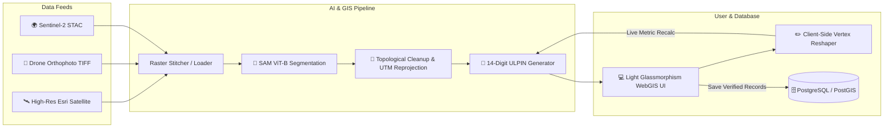

# 🛰️ BhuDrishti AI — Autonomous Geospatial Cadastral System

<div align="center">


**Autonomous Cadastral Boundary Extraction, Interactive Reshaping & Official 14-Digit ULPIN (Bhu-Aadhaar) Generation**

[Quick Start](#-quick-start) • [Architecture](#-architecture) • [Features](#-key-features) • [ULPIN Standards](#-ulpin-standards) • [Setup Guide](setup/LOCAL_SETUP.md) • [Project Report](PROJECT_REPORT.md)

</div>

---

## 🧭 System Architecture



---

## ✨ Key Features

| Capability | Description |
| :--- | :--- |
| **⚡ Sub-Meter AI Segmentation** | Extracts precise land parcel boundaries from satellite & drone imagery using Meta's Segment Anything Model (SAM ViT-B). |
| **🔢 Standard 14-Digit ULPIN** | Fully compliant with ECCMA & Government of India (DoLR) *Bhu-Aadhaar* standard derived deterministically from polygon boundary vertex coordinates (`SS-DD-TTT-NNNNNNN`). |
| **✏️ Interactive Vertex Reshaping** | Drag and modify parcel corner vertices directly in browser with real-time recalculation of geodesic area, perimeter, and ULPIN. |
| **🚁 Pure Drone Ingestion** | Drag-and-drop client-side GeoTIFF parsing via `geotiff.js` and pure `rasterio` without requiring native C++ GDAL bindings. |
| **🎨 Light Glassmorphism UI** | Modern, clean frosted-glass aesthetic with intuitive tools, live HUD telemetry, and parcel inspection drawer. |
| **📄 Certified PDF Export** | Generate printable official cadastral certificates with embedded maps, ownership records, and ULPIN barcodes. |

---

## 🏛️ ULPIN Standards Compliance

BhuDrishti generates **14-digit Unique Land Parcel Identification Numbers (ULPIN)** compliant with the Department of Land Resources (DoLR) and Electronic Commerce Code Management Association (ECCMA):

```
┌──────────┬──────────────┬────────────────────────┬──────────────────────────────────────────┐
│ State    │ District     │ Sub-District / Tehsil  │ Spatial Coordinate Boundary Vertex Hash  │
│ 2 Digits │ 2 Digits     │ 3 Digits               │ 7 Alphanumeric Characters (Base36)       │
├──────────┼──────────────┼────────────────────────┼──────────────────────────────────────────┤
│    22    │      10      │          001           │                 ZTSHS9D                  │
└──────────┴──────────────┴────────────────────────┴──────────────────────────────────────────┘
Display Format: 22-10-001-ZTSHS9D
```

---

## 🚀 Quick Start

### 1. Prerequisites & Environment
Ensure **Python 3.11** and **PostgreSQL with PostGIS** are installed.

```bash
# Clone the repository
git clone https://github.com/Aditya-Pratap-Bose/BhuDrishti.git
cd BhuDrishti

# Create and activate virtual environment
python -m venv .venv
.venv\Scripts\activate   # Windows PowerShell
```

### 2. Install Dependencies
Use Python 3.11 and install the project dependencies.

```bash
python -m pip install --upgrade pip
python -m pip install -r requirements.txt
```

For a GPU-enabled machine, install the compatible CUDA build of PyTorch before the repo requirements, then leave `LOCAL_SAM_DEVICE=auto` in `.env`:

```bash
python -m pip install --index-url https://download.pytorch.org/whl/cu121 torch
python -m pip install -r requirements.txt
```

### 3. Configure & Launch
Copy configuration and start the server:
```bash
copy .env.example .env
uvicorn app.main:app --host 127.0.0.1 --port 8000
```

Open **http://127.0.0.1:8000** in your browser to access the portal.

> The API requires a reachable PostgreSQL/PostGIS database at startup. Use
> `--reload` only after the database preflight succeeds; otherwise a supervisor
> can repeatedly restart the failed process and make the Codespace appear to
> refresh.

> GPU note: when CUDA is available, the app will prefer `cuda` for the local SAM model automatically. If no GPU is detected, it falls back to `cpu`.

> 📖 **For complete step-by-step local setup instructions, see [setup/LOCAL_SETUP.md](setup/LOCAL_SETUP.md).**
> 📖 **For the comprehensive technical specification and DFD diagrams, see [PROJECT_REPORT.md](PROJECT_REPORT.md).**

---

## 📜 License
Created with ❤️ for autonomous geospatial governance.
