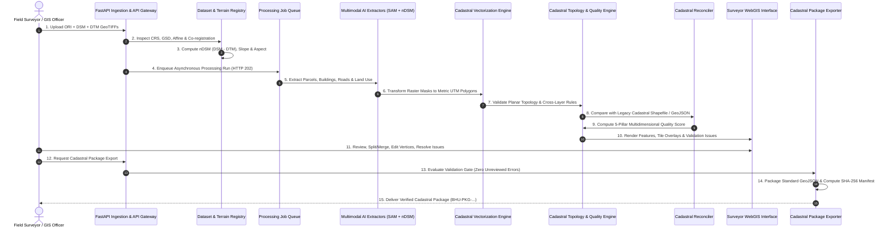

# BhuDrishti V2 — End-to-End Data Flow Specification

---

## 1. Pipeline Overview

The BhuDrishti V2 pipeline transforms raw, heterogeneous remote sensing and cadastral data into verified, topologically consistent, and government-standard cadastral survey unit packages.



---

## 2. Detailed Data Flow Stages

### Stage 1: Ingestion & Co-Registration
1. **Payload Receipt**: User uploads raw GeoTIFF files or registers path references via `POST /api/v2/datasets/` or `POST /api/v2/raster/upload`.
2. **Metadata Inspection**:
   - Extraction of coordinate reference system (EPSG code).
   - Ground Sampling Distance (GSD) resolution calculation ($GSD_x, GSD_y$).
   - Spatial bounding box ($[min_x, min_y, max_x, max_y]$).
   - Calculation of SHA-256 checksum for cryptographic data immutability.
3. **Multi-Raster Trio Validation**:
   - When ORI, DSM, and DTM are supplied for a survey unit, the pipeline asserts:
     $$\Delta \text{affine} < 10^{-5}, \quad \text{CRS}_{\text{ORI}} \equiv \text{CRS}_{\text{DSM}} \equiv \text{CRS}_{\text{DTM}}$$
   - Detects and flags any coordinate shift or spatial mismatch.

### Stage 2: Terrain Modeling & Cloud-Optimized Tiling
1. **nDSM Computation**:
   $$\text{nDSM} = \max(0, \text{DSM} - \text{DTM})$$
   Values below $0$ (noise or sensor discrepancy) are clamped to $0$. Objects with $h \ge 2.0\text{ m}$ are tagged as potential above-ground structures.
2. **Terrain Derivatives**:
   - Slope gradient ($\nabla z$) calculated via Horn's method.
   - Terrain aspect computed as downslope azimuth direction ($0^\circ - 360^\circ$).
3. **COG Generation**: Translates large rasters into Cloud-Optimized GeoTIFF with internal tiling ($256 \times 256$) and pyramidal overviews ($2, 4, 8, 16$) for dynamic HTTP tile delivery.

### Stage 3: Asynchronous Job Lifecycle
1. Client issues processing request (e.g., `POST /api/v2/jobs/`).
2. Gateway stores persistent record in `processing_jobs` table:
   ```json
   {
     "id": "7b8f9e21-0a44-4822-a27e-8c65f979c5cb",
     "job_type": "raster_extract",
     "status": "queued",
     "progress": 0.0,
     "created_at": "2026-09-08T10:00:00Z"
   }
   ```
3. HTTP 202 Accepted returned with `Location: /api/v2/jobs/7b8f9e21-0a44-4822-a27e-8c65f979c5cb`.
4. Dedicated background worker acquires lock, transitions status to `running`, executes pipeline steps, updates progress, and transitions to `succeeded` or `failed` with diagnostic logs.

### Stage 4: Multimodal AI Feature Extraction
1. **Cadastral Parcels**: Segment Anything Model (SAM) prompt encoder processes multi-spectral imagery guided by edge gradients, linear boundaries, and structural features.
2. **Building Footprints (Dual-Stream)**:
   - Stream A: Optical spectral segmentation.
   - Stream B: Elevation height mask ($nDSM \ge 2.0\text{ m}$).
   - Feature fusion suppresses false ground reflections and vegetation canopies.
3. **Roads & Access Corridors**: Linear feature segmentation identifying public right-of-ways and internal parcel access ways.
4. **Land-Use Classification**: Feature-level categorization into the controlled 8-class revenue taxonomy (`RESIDENTIAL`, `COMMERCIAL`, `INDUSTRIAL`, etc.).
5. **Provenance Metadata**: Every feature is stamped with:
   ```json
   {
     "extractor": "building_extractor",
     "model_version": "v2.1.0-ndsm-fusion",
     "confidence": 0.942,
     "timestamp": "2026-09-08T10:02:15Z"
   }
   ```

### Stage 5: Cadastral Vectorization & Simplification
1. **Raster to Vector**: Converts segmentation pixel masks into raw Shapely polygons using the affine transformation matrix.
2. **Metric UTM Transformation**: Reprojects geographic geometries (EPSG:4326) into projected metric coordinates (e.g., UTM Zone 43N / EPSG:32643) to guarantee metric precision in meters.
3. **Orthogonal Regularization**: Cadastral building regularizer snaps nearly perpendicular angles ($85^\circ - 95^\circ$) to strict $90^\circ$ right angles, producing crisp, realistic footprints.
4. **Geometry Normalization**: Collapses slivers ($< 5\text{ m}^2$), eliminates non-exterior interior rings below threshold, and repairs topological self-intersections.

### Stage 6: Cadastral Topology & Cross-Layer Validation
1. **Planar Enforcement**: Checks spatial layer for:
   - Polygons overlapping with area $> 0.05\text{ m}^2$ (`ST_Overlaps`).
   - Duplicate or near-duplicate geometries ($IoU > 0.98$).
   - Slivers with high perimeter-to-area thinness ratio ($\frac{P^2}{4\pi A} > 30$).
2. **Cross-Layer Constraints**:
   - Asserts that every building footprint polygon is completely contained within its host cadastral parcel:
     $$\text{ST\_Contains}(\text{Parcel}, \text{Building}) \equiv \text{True}$$
   - Any building crossing a parcel boundary generates an `ERROR`-level validation issue.
3. **Issue Persistence**: Issues stored in database with location centroids, severity, and status `UNREVIEWED`.

### Stage 7: Historical Cadastral Reconciliation
1. Spatial intersection between AI parcels and legacy cadastral polygons.
2. IoU calculation:
   $$IoU = \frac{\text{Area}(\text{Parcel}_{\text{AI}} \cap \text{Parcel}_{\text{Legacy}})}{\text{Area}(\text{Parcel}_{\text{AI}} \cup \text{Parcel}_{\text{Legacy}})}$$
3. Categorization into `MATCH`, `MINOR_CHANGE`, `MAJOR_CHANGE`, `NEW`, `MISSING`, or `CONFLICT`.
4. Discrepancy flags presented to surveyor for field truthing.

### Stage 8: Multidimensional Quality Scoring
1. Evaluates the 5 Quality Pillars:
   - **Raster Integrity (20%)**: Cloud cover, nodata percentage, GSD compliance.
   - **Geometric Validity (25%)**: Valid vertices, absence of spikes/self-intersections.
   - **AI Confidence (20%)**: Mean model prediction probabilities.
   - **Topology Health (20%)**: Penalty applied for unresolved overlaps, gaps, slivers.
   - **Reconciliation Agreement (15%)**: Alignment with legacy revenue cadastre.
2. Outputs aggregate score ($0-100$) and assigns quality grade ($A, B, C, D, F$).

### Stage 9: Surveyor WebGIS Review & Remediation
1. Surveyor reviews flagged topology errors and reconciliation conflicts in WebGIS.
2. Editing operations available:
   - **Split Polygon**: Slice parcel along physical boundary line or fence.
   - **Merge Polygons**: Combine consolidated holdings into a single cadastral unit.
   - **Reshape Boundary**: Drag and snap vertices to align with high-res ortho-imagery.
   - **Ground-Truth Tagging**: Attach field survey photos, CORS coordinates, and ownership identifiers.
3. Mark validation issues as `RESOLVED` or `ACCEPTED_EXCEPTION`.

### Stage 10: Cadastral Export Packaging & Provenance Manifest
1. **Pre-Flight Validation Gating**:
   - Ensures zero unresolved blocking topology errors (`ERROR` severity).
   - Validates CRS definition and geometry validity.
   - Rejects export with clear audit reasons if checks fail.
2. **Standardized Attributes**:
   - Includes 14-digit standard ULPIN / Bhu-Aadhaar identifiers.
   - Retains metric planar measurements (area in square meters, perimeter in meters).
   - Preserves standard land-use classifications without proprietary prefixes.
3. **Cryptographic Provenance Manifest Generation**:
   - Computes SHA-256 cryptographic digests for export payloads.
   - Generates structured manifest with package ID (`BHU-PKG-...`), model provenance, timestamps, and validation audit.
   - Supports GeoJSON FeatureCollections, tabular CSV registers, and bundled deliverables.
