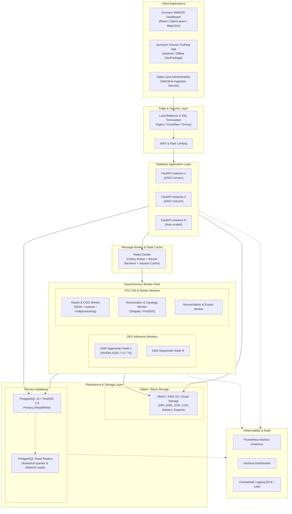

# BhuDrishti V2 — Production Deployment & Infrastructure Specification

---

## 1. Production Deployment Topology



---

## 2. Infrastructure Requirements

### 2.1 Hardware Sizing Guidelines

| Component | Minimum (Staging / Pilot) | Recommended (Production / State ULB Rollout) | Role |
|---|---|---|---|
| **API Gateway / App Server** | 4 vCPU, 8 GB RAM | 8 vCPU, 16 GB RAM (2+ instances) | Handles REST endpoints, authentication, tile forwarding |
| **GPU Inference Worker** | 4 vCPU, 16 GB RAM, 1x NVIDIA T4 (16GB) | 8 vCPU, 32 GB RAM, 1x NVIDIA A10G (24GB) or L4 | Runs Segment Anything Model (SAM) and deep learning extractors |
| **CPU GIS / Raster Worker** | 8 vCPU, 16 GB RAM | 16 vCPU, 64 GB RAM (High I/O) | Handles large GeoTIFF ingestion, nDSM calculation, COG tiling, vectorization |
| **PostgreSQL + PostGIS** | 4 vCPU, 16 GB RAM, 100 GB NVMe | 16 vCPU, 64 GB RAM, 1 TB NVMe (RAID 10) | Stores spatial features, topology records, audit logs |
| **Redis Cache / Broker** | 2 vCPU, 4 GB RAM | 4 vCPU, 16 GB RAM (Cluster mode) | Celery task queue broker, tile cache, job locks |
| **Object Storage** | 500 GB SSD (MinIO / S3) | 10+ TB S3-compatible storage with lifecycle policies | Stores raw drone flights, ORI/DSM/DTM rasters, exported packages |

---

## 3. Worker Specialization & Decoupling

To ensure optimal resource utilization and cost efficiency, workers are strictly decoupled into two dedicated pools:

### 3.1 GPU Inference Worker Pool
- **Responsibility**: Runs foundational segmentation (SAM) and neural network classifiers.
- **Scaling Metric**: GPU memory saturation and queue depth of `ai_segmentation` tasks.
- **Optimization**: Batched inference, FP16 half-precision execution via PyTorch CUDA, TensorRT acceleration where applicable.

### 3.2 CPU GIS & Vector Worker Pool
- **Responsibility**: Raster affine transformations, nDSM subtraction, COG tiling, Shapely polygonization, Douglas-Peucker simplification, and planar topology calculation.
- **Scaling Metric**: CPU utilization and queue depth of `raster_process` and `vectorize_topology` tasks.
- **Optimization**: Multi-core parallelization via `multiprocessing`, native C-extensions (GEOS, GDAL, PROJ), and vectorized NumPy array operations.

---

## 4. PostGIS Database Configuration & Tuning

For high-throughput cadastral spatial queries and cross-layer topology enforcement:

```ini
# PostgreSQL 15 / PostGIS 3.3 Production Tuning (64GB RAM Node)
shared_buffers = 16GB
effective_cache_size = 48GB
maintenance_work_mem = 2GB
work_mem = 64MB
max_worker_processes = 16
max_parallel_workers_per_gather = 4
max_parallel_maintenance_workers = 4
checkpoint_completion_target = 0.9
wal_buffers = 16MB
default_statistics_target = 100
random_page_cost = 1.1

# Spatial Indexing Mandate
# Every spatial table must have a GiST or SP-GiST index:
# CREATE INDEX idx_v2_parcels_geom ON v2_parcels USING GIST (geom);
# CREATE INDEX idx_v2_buildings_geom ON v2_buildings USING GIST (geom);
# CREATE INDEX idx_v2_validation_issues_geom ON v2_validation_issues USING GIST (geom);
```

---

## 5. Storage Architecture

1. **Vector & Metadata Storage (PostgreSQL + PostGIS)**:
   - Polygons, line strings, points, ULPIN identifiers, ownership references, topology issue logs.
   - Strictly versioned via Alembic migrations.
2. **Raster Storage (Object Storage / MinIO / S3)**:
   - Drone surveys generate tens of gigabytes per flight.
   - Raw rasters are stored in dedicated S3 bucket paths: `s3://bhudrishti-rasters/{project_id}/{survey_unit_id}/{dataset_id}.tif`.
   - Rasters are **never** stored as database BLOBs.
3. **Cloud-Optimized GeoTIFFs (COGs)**:
   - Pre-computed multi-resolution pyramidal overviews stored alongside raw rasters for instant byte-range HTTP streaming via `titiler`.

---

## 6. High Availability, Security & Scaling Strategy

### 6.1 Scaling Strategy
- **Stateless API Gateway**: Scaled horizontally behind an Nginx or Kubernetes Ingress controller using standard CPU/memory metrics.
- **Dynamic Worker Autoscaling**: KEDA (Kubernetes Event-driven Autoscaling) monitors Redis Celery queue length:
  - If `raster_jobs` queue $> 5$, scale CPU workers up to 10 nodes.
  - If `segmentation_jobs` queue $> 3$, scale GPU workers up to 4 nodes.

### 6.2 Security & Zero-Trust Compliance
- **TLS 1.3 Encryption**: Enforced in transit across all public endpoints and internal service meshes.
- **Encryption at Rest**: AES-256 for all object storage buckets and PostgreSQL tablespaces.
- **RBAC & Authentication**: JWT-based bearer authentication with role scopes (`ulb_admin`, `gis_supervisor`, `field_surveyor`).
- **Audit Logging**: Every geometry edit, split, merge, and verification decision is logged with user ID, timestamp, and previous coordinate state.

### 6.3 Health Checks & Self-Healing
- **Liveness Probe** (`/health`): Returns HTTP 200 indicating the ASGI server is running and accepting HTTP connections.
- **Readiness Probe** (`/ready`): Queries PostgreSQL (`SELECT 1`) and verifies storage availability. Returns HTTP 503 if downstream database connectivity is disrupted, preventing traffic routing to unready pods.
