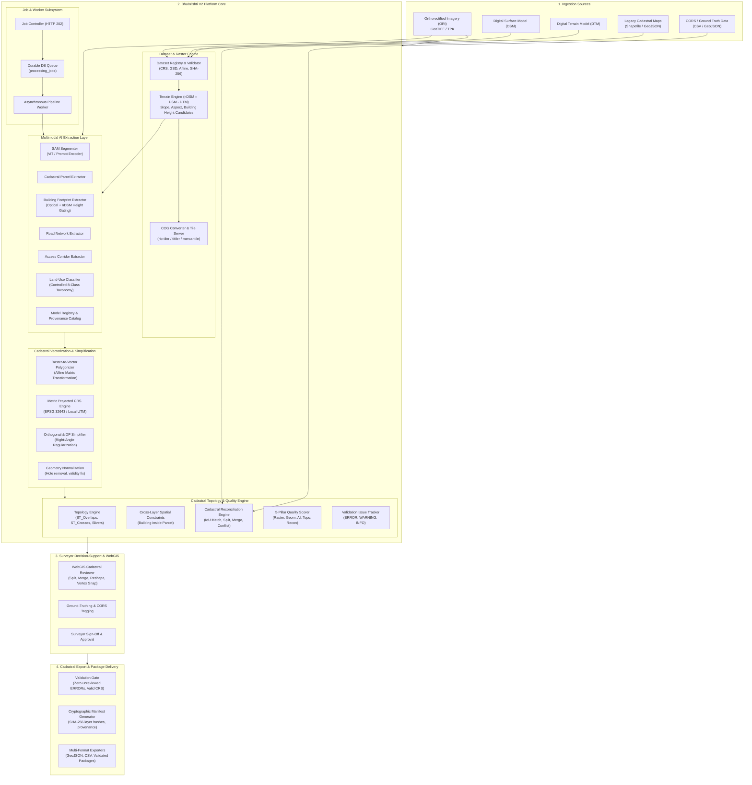

# BhuDrishti V2 — System Architecture Specification

---

## 1. Executive Summary

BhuDrishti V2 is a modular, AI-assisted Cadastral Processing & WebGIS Decision-Support Platform designed to bridge high-resolution aerial and satellite earth observation datasets with land administration workflows.

BhuDrishti operates as a **standalone computational, vectorization, topological, and quality assurance system**. It prepares survey datasets, extracts cadastral features with multimodal AI (optical + elevation), resolves topological inconsistencies, reconciles legacy revenue records, and packages standards-compliant, cryptographically verifiable cadastral survey deliverables (GeoJSON, CSV, and validation-gated packages with SHA-256 manifests) for downstream use.

---

## 2. High-Level Architecture Diagram

---

## 3. Subsystem Descriptions

### 3.1 Ingestion & Raster Subsystem (`app/services/v2/ingestion/`, `app/services/v2/terrain/`, `app/services/v2/raster.py`)
- **Dataset Registry**: Manages hierarchical entities (`Project` $\to$ `Survey` $\to$ `SurveyUnit` $\to$ `Dataset`). Performs SHA-256 file integrity verification, coordinate reference system (CRS) detection, spatial bounding box calculation, and Ground Sampling Distance (GSD) validation.
- **Terrain Co-Registration Engine**: Automatically validates pixel-alignment, coordinate congruence, and matching affine transforms between ORI, DSM, and DTM rasters. Computes the normalized Digital Surface Model ($nDSM = DSM - DTM$) to yield above-ground object heights, slope gradients (degrees/percentage), and terrain aspect azimuths ($0^\circ-360^\circ$).
- **Cloud-Optimized GeoTIFF (COG) Service**: Generates overviews and translates uploaded imagery into COG format stored in `data/v2/rasters/`, served dynamically via slippy map tiles (`/api/v2/tiles/{asset_id}/{z}/{x}/{y}.png`).

### 3.2 Asynchronous Job & Worker Subsystem (`app/services/v2/job_executor.py`, `app/api/v2/jobs.py`)
- **Durable Lifecycle**: Uses the `processing_jobs` database table with state machine semantics (`queued` $\to$ `running` $\to$ `succeeded` / `failed` / `cancelled`).
- **Idempotency & Isolation**: Background tasks execute in worker threads or separate processes. Long-running AI segmentations or large-raster polygonizations return `HTTP 202 Accepted` with job URLs, preventing HTTP connection timeouts.

### 3.3 Multimodal AI Extraction Layer (`app/services/v2/ai/`)
- **Base Architecture (`base_extractor.py`)**: Abstract contract defining `extract(dataset, **kwargs) -> FeatureCollection` with mandatory provenance metadata (`extractor_name`, `model_version`, `timestamp`, `crs`, `feature_count`).
- **Parcel Extractor (`parcel_extractor.py`)**: Predicts cadastral boundaries utilizing foundation segmentation embeddings guided by boundary priors, roads, and optical contrast.
- **Building Extractor (`building_extractor.py`)**: Employs dual-stream feature extraction combining optical spectral signatures with $nDSM$ elevation candidate masks ($h \ge 2.0\text{ m}$), eliminating low-lying vegetation and shadow false positives.
- **Road & Corridor Extractors (`road_extractor.py`, `access_corridor_extractor.py`)**: Segment linear transport infrastructure and narrow access corridors essential for landlocked parcel determination.
- **Land-Use Classifier (`land_use_classifier.py`)**: Assigns structured revenue classification codes according to an 8-class controlled taxonomy: `RESIDENTIAL`, `COMMERCIAL`, `INDUSTRIAL`, `AGRICULTURAL`, `WATER_BODY`, `ROAD_TRANSPORT`, `OPEN_VACANT`, and `FOREST_VEGETATION`, with safe `UNKNOWN` fallback.
- **Model Registry (`model_registry.py`)**: Central registry tracking model identifiers, weight hashes, and runtime execution configs.

### 3.4 Cadastral Vectorization Engine (`app/services/v2/vectorization/`)
- **Polygonization (`polygonize.py`)**: Converts binary classification masks into valid Shapely geometries using the dataset's affine georeferencing matrix.
- **Metric Projection Engine (`metrics.py`, `simplification.py`)**: Reprojects geographic coordinates ($WGS84$ EPSG:4326) into metric Universal Transverse Mercator (UTM EPSG:32643 or local zone) for accurate metric area, perimeter, and tolerance calculations.
- **Orthogonal Regularization**: Simplifies jagged raster boundary steps into straight property lines and sharp 90-degree orthogonal corners for building footprints.
- **Geometry Normalization (`geometry_cleanup.py`)**: Removes topological holes, collapses micro-slivers ($< 5\text{ m}^2$), and repairs self-intersections (`buffer(0)`).

### 3.5 Cadastral Topology & Cross-Layer Validation (`app/services/v2/topology/`)
- **Planar Enforcement**: Identifies illegal polygon overlaps ($ST\_Overlaps$), near-duplicates, unmapped gaps, and sliver artifacts.
- **Cross-Layer Spatial Rules**: Enforces legal cadastral hierarchy:
  - Building footprints must be completely contained within a parent parcel (`ST_Within`); building boundary crossing triggers an `ERROR` validation issue.
  - Parcels must not intersect designated road right-of-ways or public access corridors.
- **Persistent Validation Issue Store (`app/models/v2/validation.py`)**: Retains every flagged issue with unique IDs, coordinate locations, severity levels (`ERROR`, `WARNING`, `INFO`), and surveyor review states (`UNREVIEWED`, `ACCEPTED_EXCEPTION`, `RESOLVED`).

### 3.6 Existing Cadastral Reconciliation (`app/services/v2/reconciliation/`)
- **Automated Comparison**: Computes spatial Intersection-over-Union ($IoU$) between AI-derived parcels and historical revenue cadastral boundaries.
- **Categorization Engine**:
  - `MATCH` ($IoU \ge 0.85$): High alignment; safe for automated approval.
  - `MINOR_CHANGE` ($0.60 \le IoU < 0.85$): Encroachment, fence realignment, or slight discrepancy.
  - `MAJOR_CHANGE` ($0.20 \le IoU < 0.60$): Substantial parcel deformation, partial subdivision.
  - `NEW` ($IoU < 0.20$ or unmapped): Newly developed urban plot not present in legacy records.
  - `MISSING`: Historic revenue parcel with no corresponding structure or boundary visible in modern imagery.
  - `CONFLICT`: Cross-boundary disputes or multiple AI parcels intersecting a single legacy parcel.

### 3.7 Multidimensional Quality Scoring (`app/services/v2/quality/`)
- **5-Pillar Score Calculation**:
  $$\text{Score} = w_r S_{\text{raster}} + w_g S_{\text{geom}} + w_{ai} S_{\text{ai}} + w_t S_{\text{topo}} + w_{rc} S_{\text{recon}}$$
  Weights: Raster Quality (20%), Geometric Quality (25%), AI Confidence (20%), Cadastral Topology (20%), Reconciliation Alignment (15%).
- **Grade Assignment**: Grades A (90–100), B (80–89), C (70–79), D (60–69), F (< 60). Determines surveyor review priority.

### 3.8 Cadastral Export & Package Subsystem (`app/services/v2/exports/`)
- **Strict Pre-Flight Validation Gate**: Blocks export packaging if any unresolved `ERROR`-severity topology issues remain, if the CRS is undefined, or if geometries are invalid.
- **Standards-Compliant Cadastral Data**: Packages vector boundaries, ULPIN identifiers, geodesic areas, perimeters, and land-use categories directly in standardized GeoJSON FeatureCollections and CSV registers without proprietary prefixes.
- **Cryptographic Provenance Manifest**: Generates a tamper-evident `manifest.json` with package ID (`BHU-PKG-...`), SHA-256 layer checksums, execution timestamps, and AI model provenance for auditability.

---

## 4. V1 Protection & Non-Interference Guarantee

The V1 system remains completely isolated:
- `/api/v1/*` routes remain active and unchanged.
- Database tables `users` and `parcels` are preserved without schema mutations.
- The Colab SAM bridge and V1 standalone vector services remain functional fallbacks.
- V2 components exist exclusively within namespaced folders (`app/api/v2/`, `app/services/v2/`, `app/models/v2/`, `app/schemas/v2/`).

---

## 5. Technology Stack

| Layer | Technology | Purpose |
|---|---|---|
| **API Framework** | FastAPI (Python 3.11) | High-performance asynchronous REST endpoints |
| **Spatial Database** | PostgreSQL 15 + PostGIS | Spatial indexing, geometry predicates, topology storage |
| **ORM / Migration** | SQLAlchemy 2.0 + Alembic | Relational mapping, schema version control |
| **Vector Processing** | Shapely 2.0, GeoPandas, PyProj | Geometry manipulation, metric UTM transformations |
| **Raster Processing** | Rasterio, NumPy, GDAL | Multi-band GeoTIFF handling, nDSM, slope/aspect |
| **COG / Tile Delivery** | rio-tiler, titiler.core, mercantile | Dynamic tile generation and streaming |
| **AI Foundation** | PyTorch, Segment Anything Model (SAM) | Image feature segmentation and prompt decoding |
| **Validation** | Pydantic V2 | Strict type validation, serialization, JSON schemas |
